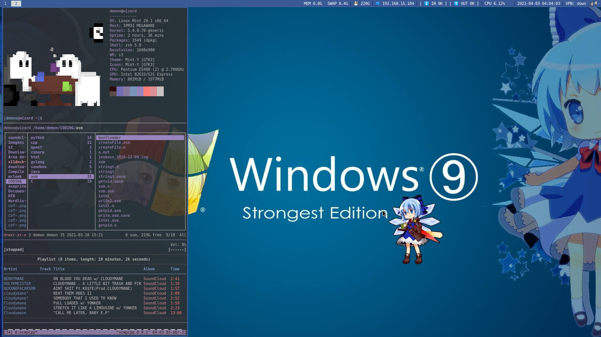
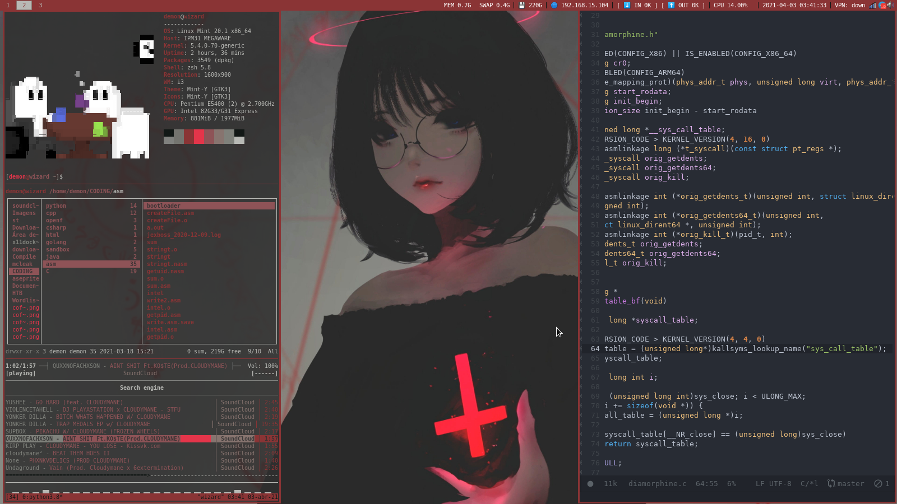
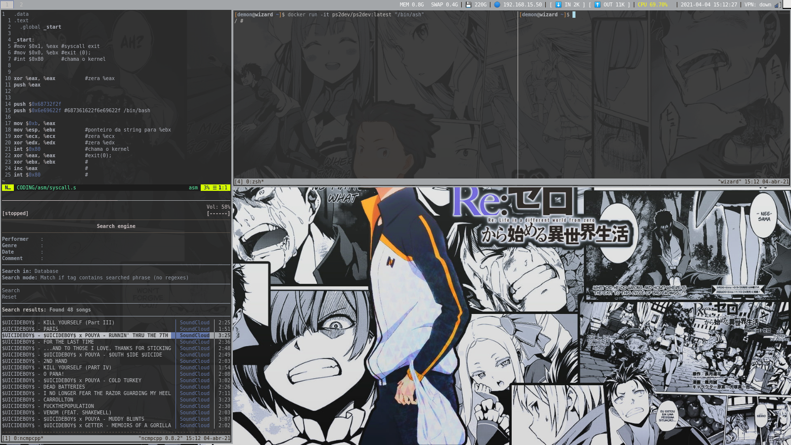

# dotfiles
My l33t dotfiles

#### Components

#####  First Screenshot

  i3wm + i3blocks 
  Ranger file manager 
  Cava 
  Ncmpcpp + Mopidy with soundcloud extension 
  LukeSmith st terminal fork (https://github.com/LukeSmithxyz/st) 
  Neofetch 
  Zsh 
  Tmux 

#### Screenshots

 
 
 
